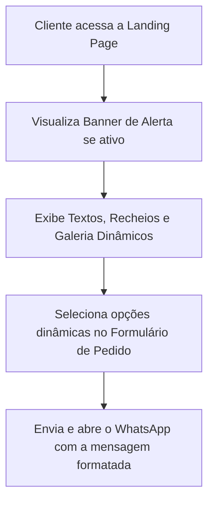
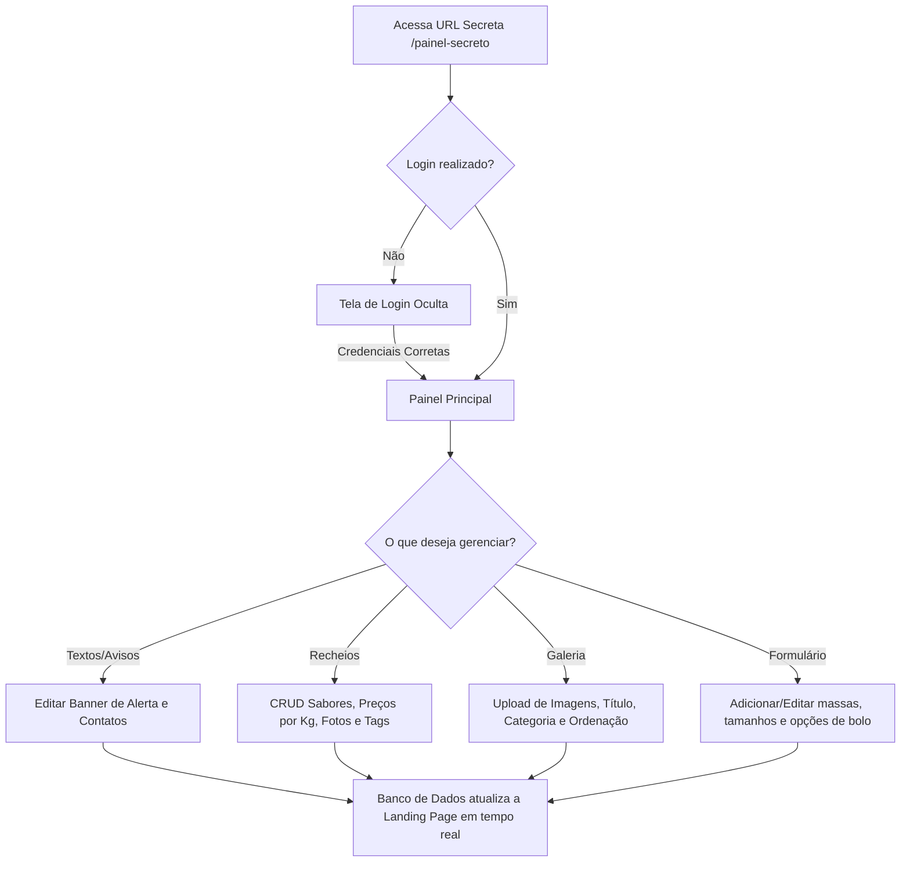

# Documento de Requisitos do Produto (PRD)
## Doce Amor | Confeitaria Artesanal

> [!NOTE]  
> Este documento foi elaborado com base no protótipo estático existente (`index.html`, `script.js` e `style.css`) da landing page da **Doce Amor Confeitaria** e atualizado com as especificações da área administrativa oculta e dinâmica solicitadas pelo cliente.

---

## 1. Visão Geral e Objetivos do Produto

A **Doce Amor** é uma confeitaria artesanal especializada em bolos decorados, recheios finos e temas personalizados. O produto final consistirá em uma **Landing Page dinâmica** para os clientes e um **Painel Administrativo oculto (com login único)** para que a confeiteira gerencie os textos, imagens, catálogo de sabores, galeria de temas e o próprio formulário de orçamentos em tempo real, sem necessidade de tocar no código.

### Objetivos Principais:
* **Autonomia Completa de Gestão:** Permitir que o administrador edite textos institucionais, imagens, recheios, galeria e opções do formulário.
* **Acesso Oculto e Seguro:** Proteger a área de login usando uma rota de URL secreta para evitar acessos indesejados.
* **Apresentar o Catálogo Dinâmico:** Exibir recheios atualizados, com preços por quilo e etiquetas de destaque.
* **Orçamentação Direcionada:** Capturar leads e estruturar o pedido do cliente por meio de um formulário dinâmico integrado ao WhatsApp.

---

## 2. Personas dos Usuários

### Clientes (Mariana, Roberto, Carla)
Buscam informações claras sobre sabores, fotos reais e profissionais de trabalhos anteriores para fechar pedidos (chás de revelação, casamentos, 15 anos).

### Administrador (A Confeiteira)
* **Perfil:** Empreendedora focada na produção de doces, que não possui conhecimentos técnicos de programação.
* **Necessidades:** Um painel simples, acessível via celular ou computador, para gerenciar toda a dinâmica do site (de textos a fotos), além de configurar as opções de massa e tamanhos que o cliente pode escolher.

---

## 3. Análise da Arquitetura do Sistema e Modelagem de Dados

O sistema utilizará uma arquitetura cliente-servidor dinâmica para suportar as atualizações da confeiteira.

### Banco de Dados Sugerido:
O modelo de dados deve contemplar as seguintes tabelas/coleções:
1. **Configurações Gerais (`configuracoes`):**
   * Título principal do site, subtítulo descritivo.
   * Telefone/WhatsApp de atendimento.
   * Links de redes sociais (Instagram, Facebook).
   * Banner de Alerta (Texto do aviso, Status ativo: `true/false`).
2. **Recheios (`recheios`):**
   * Nome, descrição, imagem/foto, preço por Kg, etiqueta de destaque (ex: "Mais Pedido").
3. **Galeria de Temas (`galeria`):**
   * Foto/URL da imagem, título (apenas), categoria (ex: Infantil, Casamento), e ordem de exibição (peso para reordenamento).
4. **Opções do Formulário (`opcoes_formulario`):**
   * Categoria da opção (ex: "Tamanho do Bolo", "Tipo de Massa", "Cobertura").
   * Valor da opção (ex: "1kg (10 fatias)", "Pão de Ló", "Chocolate").
5. **Usuários (`usuarios`):**
   * Dados do administrador único para autenticação (Login/Senha criptografada).

---

## 4. Requisitos Funcionais

Abaixo, os requisitos são priorizados de acordo com as fases de evolução do produto (MoSCoW):

### Fase 1: MVP com Painel Admin Completo (Must Have)

#### 💻 Área Pública (Landing Page do Cliente)
* **RF1.1 - Banner de Alerta Dinâmico:** Se ativado no admin, exibe um banner no topo da página com avisos importantes (ex: "Agenda fechada para este final de semana!").
* **RF1.2 - Textos e Contatos Dinâmicos:** Cabeçalho, textos institucionais do Hero, telefones e redes sociais carregados dinamicamente das configurações.
* **RF1.3 - Catálogo de Recheios Dinâmico:** Exibição em abas dos sabores com nome, descrição, foto, preço por Kg e etiquetas de destaque (ex: "Mais Pedido").
* **RF1.4 - Galeria Dinâmica com Ordenação:** Exibição de fotos com título e filtro de categorias, respeitando a ordem de exibição definida no admin.
* **RF1.5 - Formulário de Orçamento Rápido (WhatsApp Builder):**
  * Campos do formulário (Tamanho do Bolo, Massa, Recheio de preferência) carregados dinamicamente a partir das opções cadastradas no admin.
  * Botão de envio que formata a mensagem estruturada e abre o chat no WhatsApp da confeiteira.

#### 🔐 Área Administrativa Restrita (Oculta)
* **RF1.6 - Autenticação Oculta:**
  * Tela de login acessível apenas por uma rota de URL secreta (ex: `/painel-oculto` ou `/doce-painel`), definida no servidor.
  * Nenhum link ou botão visível na landing page pública deve apontar para essa rota.
  * Login único configurado de forma segura.
* **RF1.7 - Gestão de Configurações e Avisos:**
  * Alteração dos textos principais (títulos, descrições) e números de contato.
  * Controle do Banner de Alerta (digitar o texto e marcar como ativo/inativo).
* **RF1.8 - Gestão de Recheios:**
  * CRUD completo de recheios, permitindo definir: Nome, Descrição, Foto, Preço por Kg e Etiquetas (ex: "Novidade", "Premium").
* **RF1.9 - Gestão da Galeria de Fotos:**
  * Upload de fotos, definição do título e categoria correspondente.
  * Funcionalidade de ordenar as fotos manualmente (ex: arrastar e soltar ou definir um número de ordem).
* **RF1.10 - Gestão do Formulário de Pedidos:**
  * Cadastro e edição das opções de seleção do formulário (ex: adicionar nova massa de bolo, novos tamanhos em Kg).

---

## 5. Requisitos Não Funcionais

* **RNF1 - Segurança da Rota de Admin:** Proteção por token de sessão. A URL secreta não deve ser indexada por motores de busca (configuração de `robots.txt` com `Disallow` na rota secreta).
* **RNF2 - Criptografia de Credenciais:** A senha do administrador único deve ser salva no banco usando hashing seguro (`bcrypt`).
* **RNF3 - Otimização Automática no Upload:** Compressão automática de imagens para WebP no momento em que a confeiteira fizer o upload no painel administrativo, mantendo o carregamento rápido do site público.
* **RNF4 - Responsividade Mobile-First:** O painel do admin deve ser perfeitamente utilizável em celulares, permitindo uploads rápidos a partir da galeria de fotos do smartphone.

---

## 6. Fluxos de Usuário (User Flows)

### Fluxo do Cliente

### Fluxo do Administrador (Acesso Oculto)

---

## 7. Próximos Passos Propostos para Implementação

1. **Definição de Rotas:** Registrar o endpoint secreto para o painel de login e adicionar a instrução correspondente no arquivo `robots.txt` para impedir que o Google indexe a rota administrativa.
2. **Modelagem de Dados:** Criação dos schemas para recheios, fotos, opções de formulário e parâmetros do site.
3. **Desenvolvimento da API/Backend:** Estruturação da autenticação segura e endpoints para o painel CRUD.
4. **Implementação da Área de Upload:** Configurar a compressão de imagens via servidor ou serviço na nuvem (ex: Supabase Storage / Cloudinary).
5. **Integração Visual do Frontend:** Transformar a interface estática do protótipo em uma aplicação que consome as APIs criadas.
